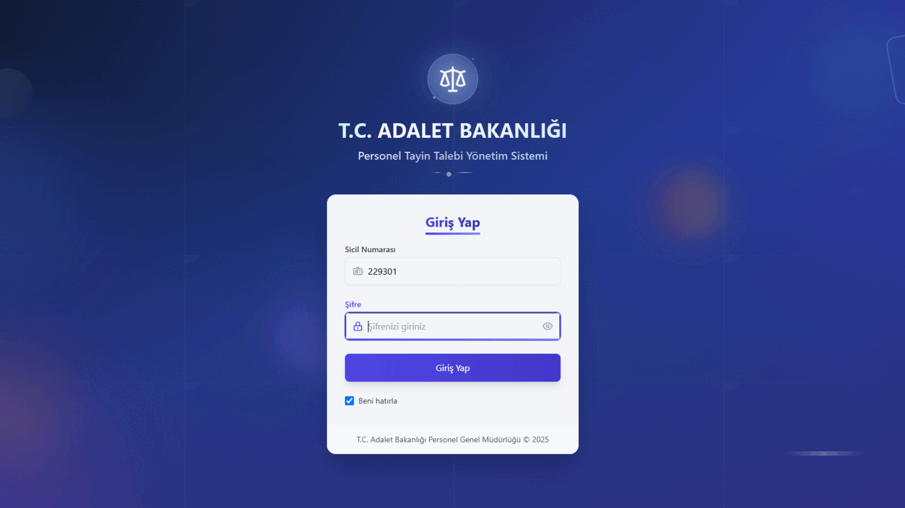

# Personel Tayin Uygulaması

Bu proje, ASP.NET Core backend ve React frontend kullanan MVC mimarisine uygun bir web uygulamasıdır.

## 📸 Ekran Görüntüleri



*Personel Tayin Uygulaması - Kullanıcı arayüzü ve temel özellikler*

## 📖 Detaylı Dokümantasyon

Projenin kurulum adımları, ekran görüntüleri ve tüm detaylı bilgileri için:
**[📋 Proje Dokümantasyonu](https://saffetcelik.github.io/tayinuygulamasi/)**

## Proje Hakkında

Tayin projesi, kullanıcı dostu arayüz tasarımı ve verimli bileşen kullanımına odaklanmış, mobil ve tablet cihazlarda uyumlu çalışacak şekilde tasarlanmıştır.

### Kullanıcı Profil Özellikleri 

- **Profil Yönetimi:** Kullanıcılar kişisel bilgilerini ve mevcut adliye bilgilerini görüntüleyebilir
- **Vektörel Türkiye Haritası:** Modern harita arayüzü ile şehir seçerek adliye tercihlerini yapabilme
- **Adliye Seçimi:** Açılır menü üzerinden adliye seçimi yaparak tayin tercihlerini sıralayabilme
- **Tayin Talepleri Takibi:** Kullanıcılar mevcut tayin taleplerini listeleyebilir, durumlarını görebilir ve taleplerini iptal edebilir
- **Sıkça Sorulan Sorular:** Kategorize edilmiş SSS bölümü ve arama özelliği ile bilgilere hızlı erişim
- **Şifre Değiştirme:** Kullanıcılar ayarlar menüsü üzerinden güvenli şekilde şifrelerini değiştirebilir
- **Karanlık Mod:** Kapsamlı karanlık tema desteği ile göz yorgunluğunu azaltan modern arayüz 

### Admin Panel Özellikleri

- **Personel Yönetimi:** Tüm personel kayıtlarını görüntüleme, düzenleme, silme
- **Tayin Talepleri Yönetimi:** Gelen tayin taleplerini inceleme, onaylama veya reddetme
- **Sistem Sağlığı Monitörü:** Enterprise-grade sistem izleme ve sağlık kontrolü
  - **Gerçek Zamanlı İzleme:** Sistem durumu, veritabanı bağlantısı, API servisleri
  - **Performans Metrikleri:** CPU kullanımı, bellek tüketimi, thread sayısı
  - **Hata Takibi:** Son 24 saat içindeki sistem hatalarını sayfalama ile görüntüleme
  - **Otomatik Yenileme:** 30 saniyede bir otomatik sistem durumu güncelleme
  - **Veritabanı İstatistikleri:** Tablo kayıt sayıları ve veritabanı yanıt süreleri
- **Log Yönetimi:** Kapsamlı sistem kayıtları yönetimi ve analizi
  - **Loglanan İşlemler:** Kimlik doğrulama, başarılı/başarısız login istekleri, tayin talepleri, sistem hataları
  - **Filtreleme Seçenekleri:** Tarih, kullanıcı, işlem türü, başarı durumu
  - **Log Temizleme:** Tüm sistem kayıtlarını güvenli şekilde temizleme özelliği
  - **Sayfalama:** Büyük log dosyalarını verimli şekilde görüntüleme
- **Sıkça Sorulan Sorular Yönetimi:** SSS bölümü için soru ekleme, düzenleme, silme
- **Sistem Testleri:** Hata senaryolarını test etme ve log kayıtlarını kontrol etme
- **API Dokümantasyonu:** Tüm API endpoint'lerini ve kullanım örneklerini görüntüleme
- **İstatistikler:** Tayin taleplerine ilişkin istatistikleri görüntüleme
- **Karanlık Mod:** Kapsamlı karanlık tema desteği ile göz yorgunluğunu azaltan modern arayüz

## Teknolojiler

### Backend
- ASP.NET Core 8.0
- Entity Framework Core
- PostgreSQL
- JWT Kimlik Doğrulama
- Swagger/OpenAPI

### Frontend
- React.js
- React Router
- Axios
- React Bootstrap
- React Icons
- React Simple Maps
- SweetAlert2
- React Toastify

## Özellikler

- **Cross-Platform Uyumluluk:** Windows, Linux (Ubuntu, ZorinOS) ve macOS desteği
- **Test Edilen Platformlar:** Ubuntu 22.04, ZorinOS 17, Windows 10/11
- **MVC Mimarisi:** Temiz ve sürdürülebilir kod yapısı
- **JWT Kimlik Doğrulama:** Güvenli token tabanlı yetkilendirme
- **Enterprise-Grade Monitoring:** Gerçek zamanlı sistem sağlığı izleme
- **Responsive Tasarım:** Mobil, tablet ve masaüstü uyumlu
- **Modern UI/UX:** Kullanıcı dostu arayüz ve kapsamlı karanlık mod
- **RESTful API:** Standartlara uygun API tasarımı
- **Docker Desteği:** Kolay deployment ve platform bağımsızlığı

## Platform Uyumluluğu

Bu proje **cross-platform** olarak tasarlanmış olup, aşağıdaki işletim sistemlerinde başarıyla test edilmiştir:

### ✅ Test Edilen Platformlar
- **Windows:** Windows 10, Windows 11
- **Linux:** Ubuntu 22.04 LTS, ZorinOS 17
- **Container:** Docker (Linux/Windows containers)

### 🔧 Platform Bağımsız Teknolojiler
- **.NET 8.0:** Cross-platform runtime desteği
- **React.js:** Tarayıcı tabanlı, platform bağımsız frontend
- **PostgreSQL:** Çoklu platform veritabanı desteği
- **Docker:** Konteyner tabanlı deployment


## Kurulum Gereksinimleri

### Zorunlu Gereksinimler
- .NET 8.0 SDK
- Node.js 18+ ve npm
- PostgreSQL 14+
- PowerShell 5.0+

### İsteğe Bağlı Araçlar
- Visual Studio 2022 veya Visual Studio Code
- pgAdmin (PostgreSQL yönetimi için)
- Docker Desktop (konteyner deployment için)

## Kurulum Adımları

### 1. Hızlı Başlangıç - Docker İmajı ile Çalıştırma (En Kolay Yöntem - Önerilen)

Projeyi tek komutla çalıştırmanın en hızlı yolu hazır Docker imajını kullanmaktır. Docker ve Docker Compose kurulu olduğundan emin olun Bu yöntemle herhangi ek bir kurulum yapmadan direkt projeyi çalıştırabilirsiniz:

```powershell
docker run -p 3000:3000 -p 5000:5000 saffetcelikdocker/tayin-app:latest
```

Bu komut:
- Hazır Docker imajını indirir
- PostgreSQL veritabanını başlatır
- Backend API'yi çalıştırır (port 5000)
- Frontend uygulamasını çalıştırır (port 3000)
- Tüm bağımlılıkları otomatik olarak yükler

**Erişim Bilgileri:**
- Frontend: http://localhost:3000 (Varsayılan Kullanıcı ve Admin giriş bilgileri aşağıda verilmiştir.)
- Backend API: http://localhost:5000  
 

### 2. Alternatif  Kaynak Koddan Docker ile Çalıştırma

Kaynak kodu indirip Docker ile çalıştırmak istiyorsanız:

#### 2.1. Projeyi Klonlama

```powershell
git clone https://github.com/saffetcelik/tayinuygulamasi.git
cd tayinuygulamasi # Proje dizinine girin docker komutunu çalıştırmak için proje dizininde olmak gerekir.
```

#### 2.2. Docker Compose ile Çalıştırma

Docker ve Docker Compose kurulu olduğundan emin olun. Proje tek komutla Docker üzerinde çalıştırılabilir, tüm bağımlılıklar otomatik olarak yüklenir ve proje başlatılır.

```powershell
docker-compose up -d --build
```

Bu komut:
- PostgreSQL veritabanını başlatır
- PostreSQL veritabanı için migration'ları uygular ve temel verileri ekler
- Backend API'yi build edip çalıştırır (veritabanı bağlantısını bekler)
- Frontend uygulamasını build edip çalıştırır
- Tüm bileşenleri Docker ağında birbirine bağlar

> **Not:** Backend konteyneri (`tayin-backend`) için veritabanı bağlantı bilgileri (`ConnectionStrings__DefaultConnection`) `dockerfiles/entrypoint.sh` dosyası içerisinde tanımlanmıştır. Varsayılan olarak `Host=postgres;Database=tayin;Username=postgres;Password=root` şeklindedir.

**Erişim Bilgileri:**
- "docker ps" komutunu terminalde çalıştırarak projenin hangi portta çalıştığını görebilirsiniz.
- Backend API: http://localhost:5000
- Frontend: http://localhost:3000 (Varsayılan Kullanıcı ve Admin giriş bilgileri aşağıda verilmiştir.)
- PostgreSQL: localhost:5432 (Docker içinde tayin-postgres konteynerinde)


### 3. Manuel Kurulum (Docker Olmadan)

#### 3.1. PostgreSQL Kurulumu ve Veritabanı Ayarları

1. PostgreSQL'i indirin ve kurun: [PostgreSQL İndirme Sayfası](https://www.postgresql.org/download/)
2. Kurulum sırasında veya sonrasında şu bilgileri not edin:
   - Kullanıcı adı (varsayılan: postgres)
   - Şifre (kurulum sırasında belirlenir)
   - Port (varsayılan: 5432)
   - Veritabanı oluşturun. ("C:\Program Files\PostgreSQL\17\bin\psql.exe" -U postgres -c "CREATE DATABASE tayin;") 
3. `server/TayinAPI/appsettings.json` dosyasını açın ve veritabanı bağlantı dizesini güncelleyin:

```json
{
  "ConnectionStrings": {
    "DefaultConnection": "Host=localhost;Port=5432;Database=tayin;Username=postgres;Password=şifreniz"
  }
}
```

#### 3.2. Backend (.NET Core) Kurulumu

```powershell
cd server/TayinAPI
dotnet restore
dotnet tool install --global dotnet-ef  # Entity Framework CLI aracını kurun
dotnet ef database update  # Veritabanını oluştur ve migrate edin
```

> **Not:** Veritabanı migration işlemi sırasında otomatik olarak varsayılan başlangıç verileri oluşturulur. Bu veriler arasında:
> - Rasgele personel kayıtları (farklı illerde görev yapan)
> - Çeşitli durumlarda (Beklemede, İncelemede, Onaylandı, Reddedildi) tayin talepleri ve tercihleri
> - Personellerin giriş, şifre değiştirme ve tayin taleplerine ait örnek log kayıtları 
> - Kategorilere ayrılmış sıkça sorulan sorular bulunmaktadır. Böylece sistem ilk kurulumda demo kullanım için hazır hale gelir.
>


#### 3.3. Frontend (React) Kurulumu

```powershell
cd ../../client  # Kök dizinden client klasörüne girin
npm install
```

#### 3.4. Otomasyon ile Çalıştırma (Manuel Kurulum Sonrası Backend ve Frontendin Aynı anda Çalıştırılması için )

Kök dizinde bulunan PowerShell scriptini kullanarak hem backend hem de frontend tek bir komutla başlatılabilir:

``` kök dizinde start.ps1 dosyasını çalıştır
./start.ps1
```

Bu script şunları yapacaktır:
- Backend API'yi http://localhost:5000 adresinde başlatır
- Frontend'i http://localhost:3001 adresinde başlatır
- Tarayıcınızı otomatik olarak frontend adresine yönlendirir

#### 3.5. Manuel Çalıştırma

Otomasyon scriptini kullanmak istemiyorsanız, backend ve frontend'i ayrı ayrı başlatabilirsiniz:

**Backend için:**
```powershell
cd server/TayinAPI
dotnet run --urls=http://localhost:5000
```

**Frontend için:**
```powershell
cd client
npm start
```


**Uygulama Erişim Linkleri:**
- Kullanıcı Girişi: http://localhost:3001
- Admin Panel Girişi: http://localhost:3001/admin/panel

> **Varsayılan Kullanıcı Bilgileri:**
>
> **Admin Paneli Kullanıcısı:**
> - Kullanıcı Adı: `admin`
> - Şifre: `123`
>
> **Personel (Deneme) Kullanıcıları:**
> 1. **Zabıt Katibi**
>    - Sicil No: `229301`
>    - Şifre: `123`
>    - Ad Soyad: Saffet Çelik
>
> 2. **Mübaşir**
>    - Sicil No: `229302`
>    - Şifre: `123`
>    - Ad Soyad: Zeynep Çelik
>
> 3. **Yazı İşleri Müdürü**
>    - Sicil No: `229304`
>    - Şifre: `123`
>    - Ad Soyad: Ayşe Demir
>
> 4. **Mübaşir**
>    - Sicil No: `229305`
>    - Şifre: `123`
>    - Ad Soyad: Ahmet Öztürk


## Sistem İzleme ve Sağlık Kontrolü

### 🔍 Sistem Sağlığı Monitörü
Admin panelindeki **Sistem Sağlığı** bölümü, enterprise-grade izleme özellikleri sunar:

#### Gerçek Zamanlı İzleme
- **Sistem Durumu:** Genel uygulama sağlığı (Sağlıklı/Uyarı/Hata)
- **Veritabanı Bağlantısı:** PostgreSQL bağlantı durumu ve yanıt süreleri
- **API Servisleri:** Tüm endpoint'lerin durumu ve erişilebilirliği
- **Otomatik Yenileme:** 30 saniyede bir güncellenme

#### Performans Metrikleri
- **CPU Kullanımı:** Gerçek zamanlı işlemci yükü
- **Bellek Tüketimi:** Çalışma belleği, özel bellek, sanal bellek
- **Thread Sayısı:** Aktif iş parçacığı sayısı
- **Uptime:** Uygulama çalışma süresi

#### Hata Yönetimi
- **Son 24 Saat Hataları:** Sistem hatalarının sayfalama ile görüntülenmesi
- **Hata Filtreleme:** Sadece sistem/veritabanı hataları (kullanıcı hataları hariç)
- **Detaylı Log Analizi:** Sistem Kayıtları menüsü üzerinden kapsamlı hata inceleme

### 📊 Veritabanı İstatistikleri
- Personel, Adliye, Tayin Talebi, Log, Admin, SSS tablo kayıt sayıları
- Veritabanı yanıt süreleri ve performans metrikleri

### 🧪 Sistem Testleri (Admin Paneldeki Sistem Testleri Bölümünden Test Edilebilir)
Çeşitli hata senaryolarını test edebilirsiniz:
1. **Manuel log oluşturma:** `http://localhost:5000/api/TestHata/log-olustur?mesaj=Test%20Mesaj`
2. **Sıfıra bölme hatası:** `http://localhost:5000/api/TestHata/bolme-hatasi?sayi=0`
3. **Veritabanı hatası:** `http://localhost:5000/api/TestHata/veritabani-hatasi`
4. **Bellek hatası:** `http://localhost:5000/api/TestHata/bellek-hatasi`

### 📋 Log Yönetimi
- **Kapsamlı Filtreleme:** Tarih, kullanıcı, işlem türü, başarı durumu
- **Sayfalama:** Büyük log dosyalarını verimli görüntüleme
- **Log Temizleme:** Güvenli toplu silme işlemi
- **Otomatik Loglama:** Tüm sistem olayları otomatik kaydedilir


## Sorun Giderme

### Veritabanı Bağlantı Hatası
- PostgreSQL servisinin çalıştığından emin olun
- appsettings.json dosyasındaki bağlantı bilgilerinin doğru olduğunu kontrol edin
- Güvenlik duvarı ayarlarınızın PostgreSQL portuna (5432) erişime izin verdiğinden emin olun

### Backend Başlatma Sorunları
- .NET SDK'nın doğru sürümünün (8.0+) yüklü olduğunu kontrol edin: `dotnet --version`
- Eksik paketleri yükleyin: `dotnet restore`


### Frontend Başlatma Sorunları
- Node.js sürümünüzün 18+ olduğundan emin olun: `node --version`
- npm paketlerini yeniden yükleyin: `npm ci`

## Proje Yapısı

### Backend (server/TayinAPI)
- **Controllers**: API endpoint'lerini içerir
- **Models**: Veri modellerini içerir
- **DTOs**: Veri transfer nesnelerini içerir
- **Data**: Veritabanı bağlantısı ve DbContext'i içerir
- **Services**: İş mantığı servislerini içerir
- **Migrations**: Veritabanı migration'larını içerir

### Frontend (client)
- **src/components**: React bileşenlerini içerir
- **src/pages**: Uygulama sayfalarını içerir
- **src/services**: API isteklerini yöneten servisleri içerir
- **src/context**: React context'lerini içerir
- **src/utils**: Yardımcı fonksiyonları içerir